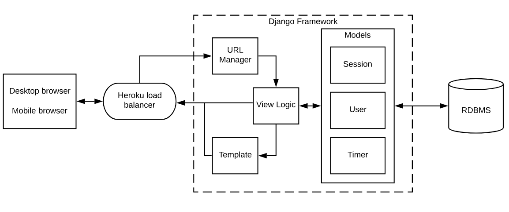

# pomodoro posse group
Pomodoro app project for CS361!

## High level architecture

## To run
1. Ensure that the secret key variable has been set on your local environment
1. Navigate to the root directory of the project
1. Run `python3 manage.py runserver`

---

## Setting environment variables

### Generating secret keys
1. `python -m pip install Django`
1. `python3`
1. `from django.utils.crypto import get_random_string`
1. `chars = 'abcdefghijklmnopqrstuvwxyz0123456789!@#$%^&*(-_=+)'`
1. `SECRET_KEY = get_random_string(50, chars)`
1. `print(SECRET_KEY)`

### bash/zsh(macOS)
1. Open terminal
2. Type in `export SECRET_KEY='[value]'` (replacing [value] with the secret key you are using)

### Windows 8/10
1. In Search, search for and then select: Edit environment variables for your account
1. In the User variables section, click New to open the New User Variable dialog box.
1. Enter 'SECRET_KEY' and its value, and click OK. The variable is added to the User variables section of the Environment Variables dialog box.
1. Click OK in the Environment Variables dialog box.

---

## Adding new database models
1. Update the models.py file in the desired app
1. If the app is not already listed under the INSTALLED_APPS section of the settings.py file, add it there
1. Run `python3 manage.py makemigrations [app name]`
1. You should get an output siimlar to `[app name]/migrations/0003_auto_20200712_1548.py`
1. Next run `python3 manage.py sqlmigrate [app name] [migration number]` (migration number in the above step is shown as '0003')
1. Lastly run `python3 manage.py migrate`

## Updating existing database models
1. If you were in the python shell when the updates were made, then run `exit()`
1. `python3 manage.py shell`
1. `from [app name].models import [class name]`

---

## Interacting with data to tables
You will always need to first run: `python3 manage.py shell`

### To import a table
1. `from [app name].models import [class name]`

### To display data in table
1. Show all items: `[class name].objects.all()`

1. Display primary key for object: `[object name].pk` or `[object name].id`

### To add data to a table
1. `[desired object name] = [class name]([attribute1]=[attribute1 value], [attribute2]=[attribute2 value], etc.)`
1. `[obect name from above step].save()`